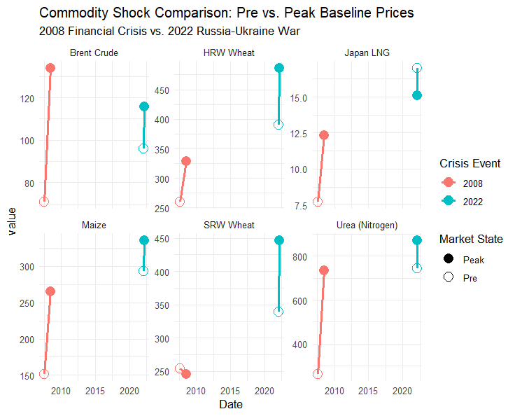

# Geopolitical Commodity Shocks

An empirical, multi-stage quantitative model analyzing price transmission elasticities across the global energy-fertilizer-food value chain using World Bank "Pink Sheet" and Our World in Data (OWID) historical records. 

*Read the full [How Energy Shocks Feed Into Fertilizer and Food Prices](https://impakter.com/hormuz-strait-blockade-how-energy-shocks-feed-into-fertilizer-and-food-prices/) article and [The Hidden Price of Oil](https://impakter.com/the-hidden-price-of-oil-how-crude-shapes-the-cost-of-everything/) article on Impakter.com.*

---

## 📌 Analytical Framework
Modern agricultural yields and industrial supply chains are structurally bound to upstream energy pricing. This repository hosts an end-to-end R pipeline tracing how energy costs propagate across global markets, verifying two distinct macroeconomic frameworks:

### 1. The Energy-Fertilizer-Food Chain Reaction (Chapter 1)
This framework models a tightly coupled, vertical price transmission chain where upstream energy directly dictates downstream food security:
*   **The Input Channel:** Upstream natural gas (the essential feedstock for the energy-intensive Haber-Bosch process) systematically drives the cost of intermediate chemical fertilizers like Urea (Nitrogen-based Fertilizer) and DAP (Phosphor-based Fertilizer).
*   **The Downstream Ripple:** As production and freight logistics costs compound, these input spikes pass sequentially into essential crop staples (Maize, Wheat, Rice), proving that global food prices are fundamentally an extension of the energy market.
*   **Intensification vs. Extensification:** The pipeline proves that global crop yields remain strictly dependent on fertilizer input density (intensification) rather than on clearing more agricultural land (extensification).

### 2. The Broader "Crude Oil Nexus" (Chapter 2)
Moving beyond food staples, this framework treats crude oil as a universal cost index that shapes the baseline floor for otherwise uncorrelated global industries:
*   **Vegetable Oils & Biofuels:** Higher crude benchmarks trigger demand-side shifts into biofuels, establishing an artificial price floor that pulls cooking oils (Palm, Soybean, Sunflower, Rapeseed) upward.
*   **Industrial Base Metals:** Upstream energy drives the heavy operational realities of mining extraction and high-heat metal smelting (Aluminum, Copper, Zinc, Iron Ore).
*   **Soft Industrial Inputs:** Crude impacts rubber markets through synthetic-to-natural substitution parity and shapes forestry markets via maritime freight lines. Creating a clear geographic divergence between oceanic-shipped Cameroon logs and domestic Malaysian timber.

## 📊 Empirical Visualizations

### 1. Crop Yields vs. Fertilizer Intensification (Chapter 1)
Using raw global agricultural data from 1961 to the present, our visualization confirms that staple yields closely track raw chemical nutrient applications (intensification), while showing independent movements relative to changes in global land boundaries (extensification).

### 2. The Global Price Transmission Network (Chapter 1)
By calculating Pearson correlation coefficients across 14 distinct asset classes, this macro network illustrates the powerful relationship running from upstream inputs to retail commodities. High-density connections bind European Natural Gas directly to Urea synthesis and Maize pricing.

### 3. Historical Shock Comparison: Pre vs. Peak Prices (Chapter 1)
To contextualize transmission limits during crises, this panel benchmarks baseline pricing environments against peak crisis metrics across core commodity layers during the **2008 Financial Crisis** and the **2022 Russia-Ukraine War**. The visualization illustrates exactly how downstream crop assets and intermediate inputs mirror major upstream energy disruptions during a systemic supply shock.

### 4. Cross-Asset Energy Nexus: Commodities (Chapter 2)
A unified, multi-panel matrix tracking how upstream crude oil markers pass directly into consumer soft commodities. It highlights the biofuel mandate link driving high correlations in vegetable oils (soybean, sunflower, palm), meat production costs, and the stark geographic freight-cost divergence between maritime-shipped Cameroon logs and domestic Malaysian timber markets.

### 5. Cross-Asset Energy Nexus: Industrial Markets (Chapter 2)
A complete macro layout mapping crude variations against heavy industrial inputs. This panel visualizes oil's reach through mining/smelting processing costs for base industrial metals, synthetic-to-natural rubber market substitutions, and the behavior of precious metals. Where industrial-input platinum tracks crude tightly, while store-of-value gold acts as a sentiment-driven macro outlier.

