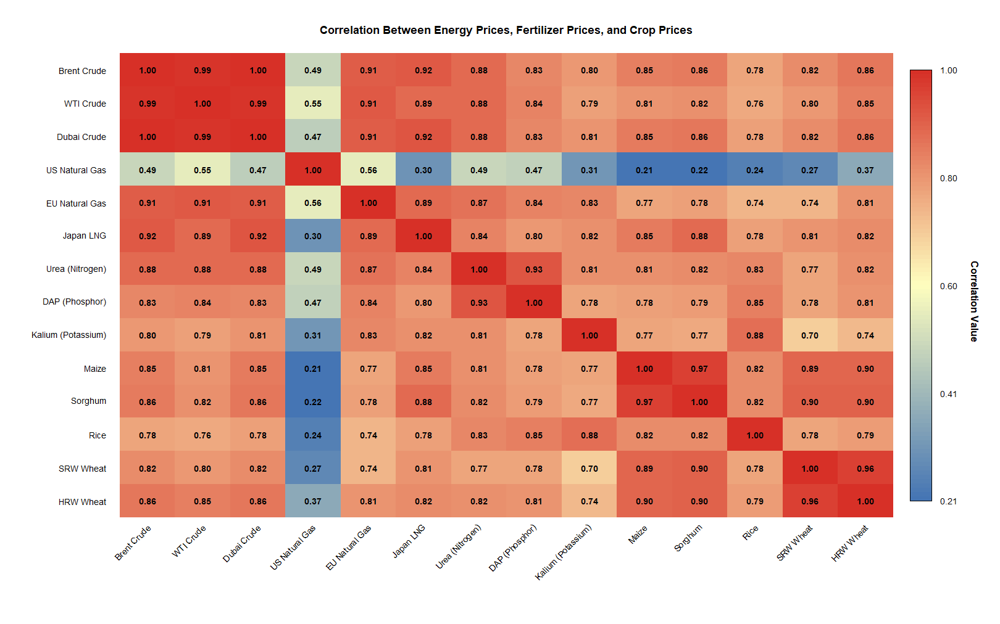
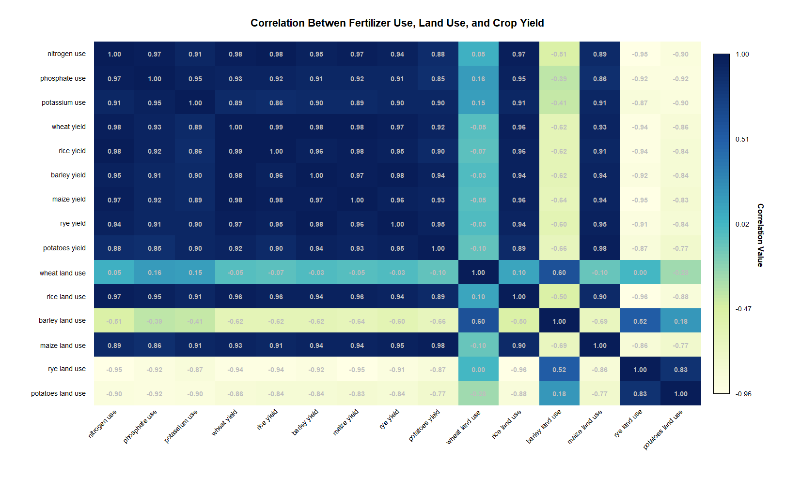

# macro-commodity-transmission

An empirical, multi-stage quantitative model analyzing price transmission elasticities across the global energy-fertilizer-food value chain using 60+ years of World Bank "Pink Sheet" and Our World in Data (OWID) historical records. 

*Read the full published analysis on [Impakter](https://impakter.com/hormuz-strait-blockade-how-energy-shocks-feed-into-fertilizer-and-food-prices/).*

---

## 📌 Analytical Framework
Modern agricultural yields rely heavily on energy-intensive chemical synthesis (the Haber-Bosch process for nitrogenous fertilizers). This repository hosts an end-to-end pipeline constructed entirely in **native Base R** to prove two key structural theses:
1. **The Cost Transmission Channel:** Upstream energy shocks (Crude Oil & Natural Gas) pass directly into intermediate fertilizers (Urea, DAP), dictating final grain staple prices (Maize, Wheat, Rice).
2. **The Intensification Dilemma:** Agricultural expansion (extensification via land use) has historically remained flat and shows a near-zero correlation with actual global food security, which remains bound to fertilizer-driven crop yields (intensification).

---

## 📊 Empirical Visualizations

### 1. The Global Price Transmission Network
By calculating Pearson correlation coefficients across 13 distinct asset classes, the macro network illustrates a powerful relationship running from upstream inputs to retail commodities. High-density connections ($r > 0.85$) bind European Natural Gas directly to Urea synthesis and Maize pricing.

### 2. Crop Yields vs. Fertilizer Intensification
Using raw global agricultural data from 1961 to the present, our visualization confirms that staple yields tightly track raw chemical nutrient applications while showing independent movements from changes in land boundaries.

---